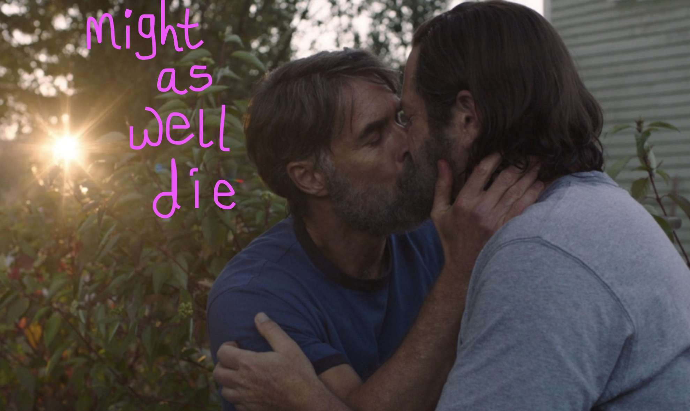
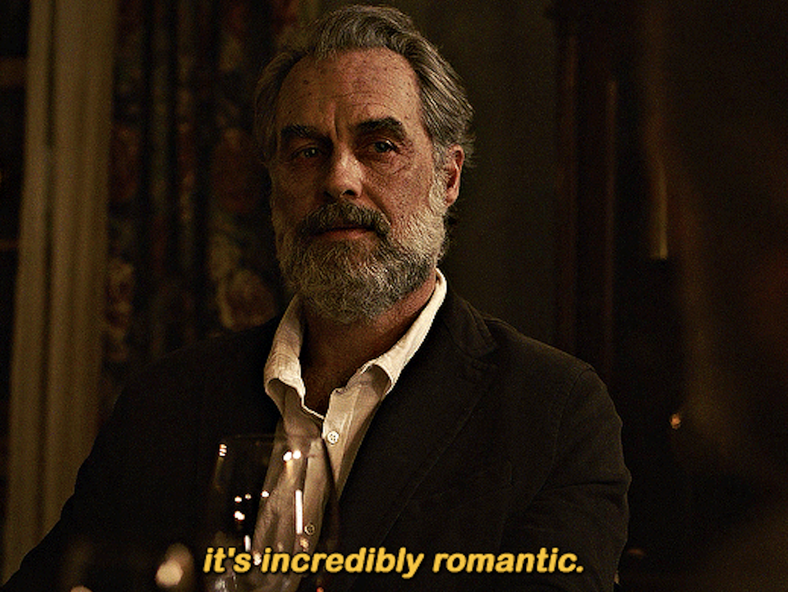
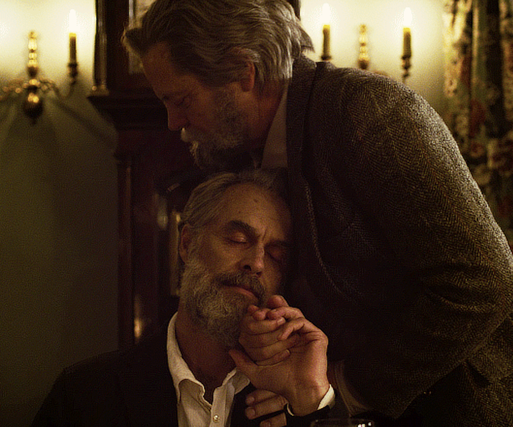

+++
title = "'The Last of Us' Is Killing Me"
date = 2023-02-22T12:00:00+00:00
draft = false
featured_image = "last+of+us+disabled+2.webp"
tags = ["TV", "Disability", "Ableism"]
+++

## “And I, I must confess, I still believe…” that ableism is alive and well on TV’s most-hyped show

TRIGGER WARNING: Contains discussions of disability, assisted suicide, suicide, ableism on TV and in pop culture, and the “Bury Your Gays” trope.

WARNING: Contains major spoilers about The Last of Us Season 1.

My brother and I argue about who would die first in a zombie apocalypse: the one with multiple sclerosis (me) or the diabetic (him). While this might sound morbid, it’s strangely therapeutic to wrestle with your chances of survival when they’re thinner than most. Of course, the end of the world is made more difficult when you rely on medication 24/7, and can't guarantee the physical energy required to flee from a Bloater. But aside from the obvious logistical challenges, The Last of Us presents an even bleaker picture for disabled people in an apocalypse event, and suggests death is the only option.

While Twitter was alight with heart emojis for Frank and Bill’s unexpected love story, some of us were frantically Googling which neurological disease Frank acquired by the end of the episode — Co-creator Craig Mazin confirmed that Frank has either multiple sclerosis (MS) or amyotrophic lateral sclerosis (ALS). The symptoms, though subtle, hit close to home for those of us struggling to get out of bed or lacking the energy to eat or wondering if the damn pills are even working anymore. We have lived-experience of Frank’s painting frustration, his artistic prowess torn to shreds by an invisible disease attacking his brain. And we, too, have wondered if the days ahead were worth living, if the pain would set in our bones like a Madame Tussauds plaster cast, left on too long, imprisoning us in clay.

It goes without saying that suicide is tough viewing for anyone. But when the scene involves a disabled character with the diagnosis you received a decade ago, it’s excruciating. I've seen the storyline applauded for its take on assisted suicide, which is absolutely valid. I’m not doubting the need for assisted suicide in some cases, or the feeling that life is hopeless when your body's a cage of nerve pain and bone ache — believe me, I’m there often. However, when suicide is one of the only disabled narratives portrayed onscreen, ever, it's a sledgehammer to the temple. It's all we ever get, again and again. And without alternative story arcs, we're being told our lives simply aren't worth living. That from an able-bodied viewpoint, we're better off dead.

While I appreciate every gay love story TV throws at me, especially when it involves Murray Bartlett, Frank's illness, and speedy death, isn’t crucial to his character development. Instead, it signals to the audience that disabled love is about helping someone die (See: Me Before You), and that living with a diagnosis of MS, ALS, or any other degenerative condition, is a literal death sentence. As if utilizing the “Bury Your Gays” trope wasn’t bad enough, the episode decides to bury its disabled too, and the lack of a trigger warning hit hard. It was a bait-and-switch of A Man Called Otto proportions.

Frank’s disability isn’t the only horror here. There’s the woman in a wheelchair in the first episode, who slowly mutates into a zombie in the background of a scene, an interchangeable disabled body used as an object of horror like this is a ‘90s slasher. And in episode 5, there’s Sam, a Black Deaf kid and cancer survivor, on the run with his older brother. The inclusion of Deaf actor Keivonn Woodard is exciting, but from the get go, it's clear his character isn't making it out of this alive. In fact, Sam is marked for death the moment his brother paints a superhero mask on his face, accentuating the idea that disabled people are "brave" simply for existing.

Before someone tries to tell me I’m overthinking it — I have ADHD, so probably. With the death of each disabled character, The Last of Us has signalled that this is an able-bodied story, told through a "sick-free" lens. Viewers are guided to shed a tear and thank Britney they don’t have an incurable condition or disability, as they continue on Joel and Ellie’s journey. But I died in the third episode, reminded that my brain and body will fail me, and that for most, death is preferable to being disabled.
