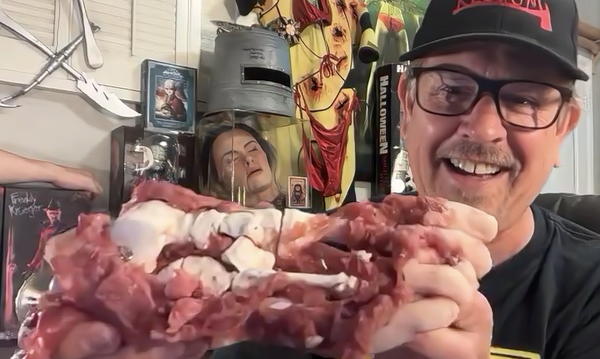
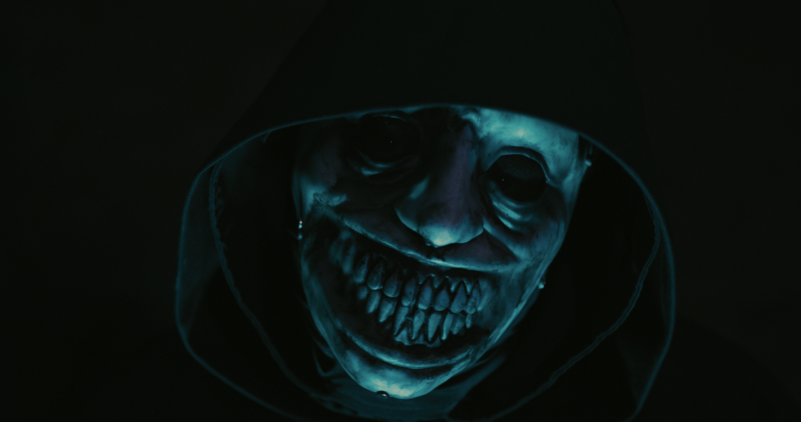
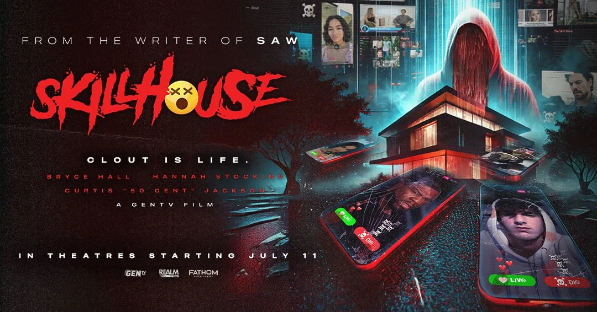
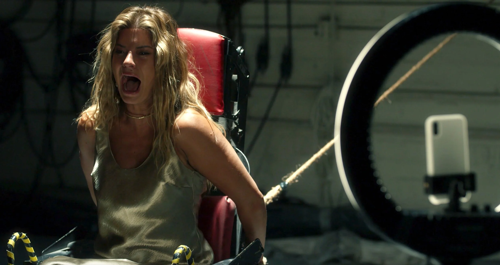

+++
title = "Josh Stolberg on 'Skillhouse,' His Favorite Movie Kills, and Working With Tobin Bell on the 'Saw' Franchise"
date = 2025-07-13T12:00:00+00:00
draft = true
featured_image = "new+josh+foot.webp"
tags = ["Movies", "Horror", "Saw"]
+++

To horror aficionados, [Josh Stolberg](https://www.instagram.com/joshstolberg) needs zero introduction. Having co-written 2009 slasher *Sorority Row*, 2010's *Piranha 3D*, and three installments of the [*Saw* Franchise](https://www.bustle.com/articles/147508-gilmore-girls-star-scott-pattersons-most-underrated-role-is-in-a-movie-you-wouldnt-expect) (2017's *Jigsaw*, 2021's *Spiral*, and 2023's *Saw X*), Stolberg not only appreciates a great on-screen kill, but understands just how important the lore is, too. With 2025's *Skillhouse*—[now in theaters](https://www.fathomentertainment.com/releases/skillhouse/)—a social media satire and slasher featuring a cast of real-life influencers, Stolberg takes the helm as both writer and director. He also just launched a podcast, "[Darren & Josh Make a Movie](https://www.youtube.com/@DJmakeamovie)," with *Saw* collaborator Darren Lynn Bousman. In a seriously fun interview, the auteur talks *Skillhouse*'s inspirations, how he develops his now-famous movie kills, and what it was like collaborating with Jigsaw icon Tobin Bell.

### It must be exciting to have *Skillhouse* finally coming out? It's such a unique take on what I'd call the "horror game genre," and even references other films in that genre like *Escape Room* and *Saw*.

It's been a couple of years since we shot it; I'm so happy we're finally getting it out into the world. That was the fun thing for me, to kind of play in the *Escape Room* and the *Saw* worlds, but to come at it as a satire. In a lot of ways, I would look at this less as a straight-up horror movie, and more of a horror satire, in that we're really kind of skewering the influencer culture.

### Did you have any other movies or antagonists in mind when you were developing *Skillhouse*’s Triller Killer?

You know, you're always coming at things trying to figure out something new, something a little different. Our FX guy was Steve Johnson, he's one of the best in the business. He designed ghosts for Ghostbusters [including Slimer and the Librarian Ghost] way, way back in the day. And he was the one who came up with this idea of the Triller Killer mask, which I just loved. I hadn't had it in my mind [what the Triller Killer mask looked like] when I was writing, but he approached me with the idea of a horrible face underneath and then this shiny overlay. We kind of greased it up with Vaseline, so that depending upon which way the Triller Killer was looking, it would illuminate a little bit of the background. 

What was wonderful about [the mask]—and something that I talked to Steve about when we were trying to figure out what the design was going to be—was this idea of the reality underneath, and this plastic shell over [the top]. It really was one of those things that it made me think of influencers, and this fake life that most of them are living. You know, you read about these poor kids who are online; it looks like they're counting their money, but then they can't pay their rent. They're pretending they're hugely successful and they're struggling inside. So the mask itself worked well in the thematics of what we were trying to do. We got to see it in different layers, and bits coming off, and that made it interesting. We even digitized it at some points to really play with that.

As far as who the killer was, that always changes while you're writing a script. You know, I just came off of *Saw X*, and we probably changed things up 12 times before we locked into what the final movie was going to be.

As the writer of Skillhouse and some of the Saw films, you’ve had to figure out lots of intricate ways for people to die. Is it a strange experience dreaming up elaborate deaths for your characters?

That's my favorite question, because there is nothing I like more in the writing process than coming up with unique, crazy ways to kill people. I've got a few different partners that I write with. My buddy Pete [Goldfinger], who I wrote [Jigsaw, Spiral, and Saw X], and Piranha 3D and Sorority Row with, we'll go on vacation together and we'll be on a cruise ship and see the big anchor with the big chains going around. And one of us will be like, "You know how I'd kill you? I would put you in, just as it was turning..." I can't use a garbage disposal. I can't use anything without thinking, "All right, how would I kill somebody with this?" It's both a curse, but I absolutely love it. 

The crazy thing—and you probably know this from being such a fan of horror movies—is the horror community, the people involved in it. If you listen to, you know, sermons from pastors across the country, you'd think that we're all demented crazy people. But the horror community, the people that make horror movies, are some of the nicest, sweetest, most fun people I've ever worked with. It's the comedies that are the crazy people. You're working on comedies where everybody's freaked out: "Is it funny enough? Is it funny enough?" And we're just all having a blast making horror movies

### That's one of the reasons I love the *Saw* movies, because there's such a sense of justice in the story. People think I'm sick when I defend John Kramer…

I agree 100%. I look at horror movies as they're going on a rollercoaster. You don't pay your money for the rollercoaster to not scare the living shit out of you. You get on it hoping that you're going to face death and live to tell the tale. I feel the same way every single time I walk into a theater to see a new horror movie. It's always amazing when something really surprises me and makes me feel like, "Oh my God, I need to close my eyes." Those are the moments, that's the reason why I love the genre so much.

### Do you have a favourite death in *Skillhouse*, or in any of your other films?

Probably my favorite death I've ever written was in [*Sorority Row*](https://www.amazon.com/Sorority-Row-Teri-Andrzejewski/dp/B009HEM3B4). There's a scene [that] was beautifully directed by [Stewart Hendler](https://www.imdb.com/name/nm0376664), where one of the characters who's the alcoholic friend—you know how you always have to kill somebody with their vice? The alcoholic friend has got a wine bottle, and she kind of swigs back, and the killer shoves it down her throat, and then uses a tire iron to break it in her throat. It shatters and you see the blood and the wine coming out of her mouth.

As far as *Skillhouse* goes, there is one that's my new favorite because of what it means thematically to me. There's a scene later in the movie where [Dani Oliveros](https://www.instagram.com/dani.oxo/), who plays Kirsten, is tasked with cutting her face off. Basically using a knife, cutting it down, and then ripping the skin off. We did it all practically, the makeup team led by Steve Johnson was just on another level. What I loved about it was how beautifully it intersected with the theme of the movie that we were making. She's literally crying to the audience and saying, "Why are you making me do this? Why do you need to see this?" And that's what's getting the likes; the more she cuts, the more she gets likes. For me, thematically what we were dealing with is the idea of spectacle for profit. The audience is complicit in watching these kids jumping off of fucking buildings and killing themselves for likes. Those videos go viral and then it makes other people want to do the exact same thing. To me, that kill scene really works on two different levels, so I'm really proud with the way we were able to frame it.

### I loved [Neal McDonough](https://www.instagram.com/neal_mcdonough/)'s character, a police officer he played with such menace and so much fun. Was his character on the page or did he improvise on set?

Neal is amazing. He was our ringer. When we brought him in, we were obviously dealing with a few actors who had never even acted before, because they were influencers first. I knew I needed to surround them with some great actors. I would say that almost all [of Neal's] lines were written, and I was really trying to channel some of my crazy. There's one line that I still can't believe they let me do [in which Neal's character threatens to skull-fuck one of the influencer's siblings with their rib after he kills them]. He delivers it with such menacing grace. He's incredible.

There was a moment in the film where I wasn't getting exactly what I wanted from the actors—when the officer first pulls up in the squad car. In the first few takes, they looked scared, but they were acting like they were scared. At one point, I pulled Neal off to the side and [said], "Hey, Neal, they're just not reacting the way that they should, based on the story." He was like, "Let me do a little something." The next time he got out of the car, he was a monster screaming, yelling, and we used that take of the kids. I didn't use his coverage, but I used the reverse, showing the kids from that take, because he just scared them to death. You could really see it on their faces, and that's when a couple of the kids started crying. It was great.

### *Skillhouse* is about our relationship with social media. You actually have such a kind and generous online presence, including your Reddit interactions with critics of your work. How do you manage to have so much grace when people are leveling these criticisms at you?

I look at it a little bit like I'm lucky that they're even throwing criticisms at me. I'm lucky to be in this world. I am lucky that they hired me to write those *Saw* movies. I was lucky to work with Tobin Bell one on one, to work with Chris Rock. I am just lucky to be there. One of the toxic things about the social media community is their willingness to spit venom, because they're hiding behind a screen. My approach is not to spit it back. My approach is to lead with kindness and lead with a smile, and maybe try to influence them. In the same way as I'm a parent, you try to model behavior to your kids—you know, it's the kids that get beaten and struck with belts that beat their own kids. But ultimately, I'm a happy person, I love people, and I'd much rather interact with people in a playful, nice way.

### I would be remiss if I didn't ask about *Saw X*. Everybody loved that movie and it must have been such a fun journey bringing it to the screen. What was it like working with [Tobin Bell](https://www.instagram.com/tobinbellofficial/)?

It was so nice, because as you know, having followed the *Saw* franchise, I took it on the chin for the first two [movies] I worked on. *Jigsaw* got a ton of criticism... *Spiral* we really tried to do something different, and spin it in a different direction, and that didn't land for audiences in the way that we wanted it to. So getting a third bite at the apple and being able to to go to the studio and say, "We believe the criticism for the first two I worked on was that Tobin wasn't in it enough." I was like, "I want to do Tobin's story. I want Tobin to be the lead. I don't want there to be a frame of the movie that he's not in." Luckily for me, they were like, "All right. We haven't done that before, so let's give it a shot." 

Tobin is such an incredible actor. He's so good and when we're working together, we're riffing off of each other. I have audio recordings of Tobin. I pulled into a Costco one day and he called me up with an idea for a line in *Saw X*—I think it's in the extras, not in the actual movie. He starts talking about the idea of fishing, and the idea of phishing—it's the same. The way that they do it on the internet and how [John Kramer] got scammed is the same as fishing and baiting the hook and all these things. And I'm sitting there in a Costco, my computer open, taking notes, recording it on the side. So that opportunity was everything to me. And being able to write the one *Saw* movie that's got a fresh score on Rotten Tomatoes was lovely, especially since most of the shit that I write is so far away from a fresh rating on Rotten Tomatoes. It was fun to be able to bring the audience something that surprised them, because I think we made a pretty great film.

### BOOK [TICKETS FOR *SKILLHOUSE*](https://www.fandango.com/skillhouse-240803/movie-overview) NOW.

*Edited for length and clarity.*

